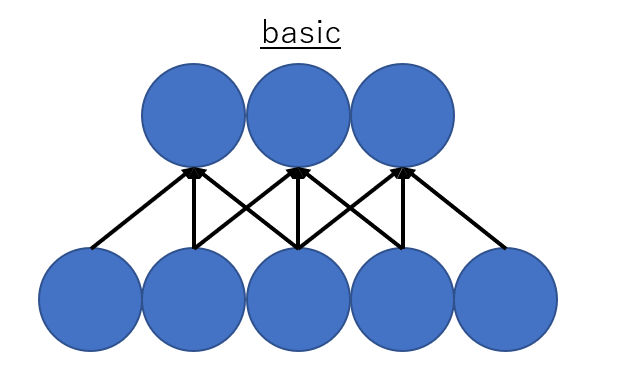
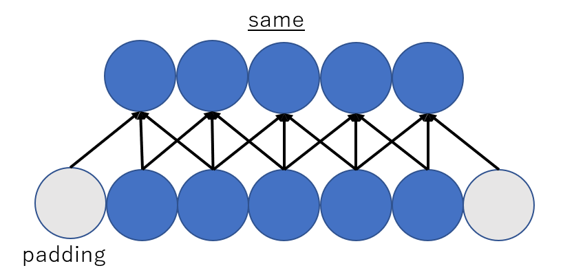
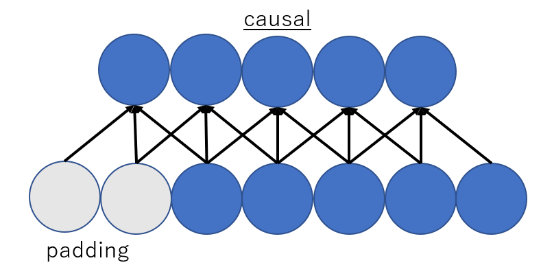
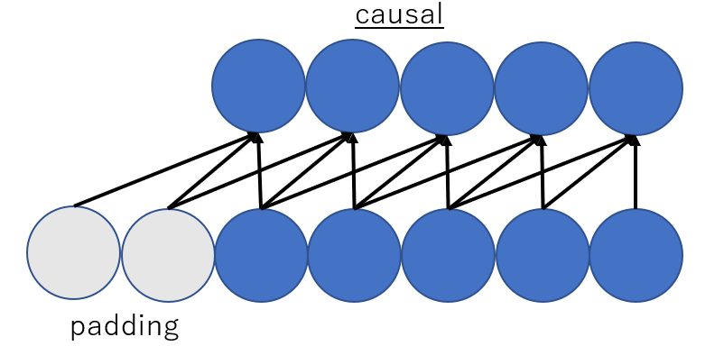

# 自分用メモ

## バージョン管理
tensorflow==2.3  
CUDA==10.1  
CuDNN==7.6.5  

## Tensorflow2.3について
Tensorflow(TF)1系とTF2系では，Define-and-run形式からDefine-by-run形式に変わるためかなり変わります．Kerasユーザはあまり変わらないと思います．kerasとtf.kerasが同時に存在するとTensorflow LITEに変換時にエラーが出たりするので，tf.kerasで統一したほうがいいと思います．  

### ReadTimeoutError が起きた場合
インストールに時間がかかりすぎた場合に出るエラーです．
> pip --default-timeout=100 install tensorflow-gpu==2.3.0  

でなんとかなります．

## WaveNetのtflite変換について
TF1.14.0ぐらいではCausal Convolutionが，TF2.1ぐらいではDilated Convolutionのtflite変換ができないです．そのため，TF2.3未満を使っている方でWaveNetのtflite化でエラーが出る方はTF2.3にアップデートすれば問題が解決するはずです．

## causal convolutionについて
CNNを用いる時に，入力系列と同じ長さの出力を得るためにパディングを行うことがよくあります(左図: パディングなし，右図: パディングあり)． 
    
昨今ではWaveNetの登場以来，CNNを用いて時系列処理を行う場合では将来の情報を用いないようにするためにCausal Convolutionが使われています．  
 
実装上では前方向にパディングするだけでできます．  

## CUDA再インストール
Windowsの場合では，コントロールパネルから"cuda"と検索すると何種類かアプリケーションが出てくるので手動ですべて削除． 
tensorflow2.3の場合はCUDA10.1をインストール(以下URL) 
https://developer.nvidia.com/cuda-10.1-download-archive-base?target_os=Windows&target_arch=x86_64&target_version=10&target_type=exenetwork

## CuDNNのインストール
以下サイトからCuDNNをインストールする．  
https://developer.nvidia.com/cudnn  
アカウント登録が必要ですがgoogleアカウントでもログイン可能です．  
いくつか質問に答えた後で，CUDAとOSに対応するCuDNNのインストールを行う．  
zipファイルのダウンロード後にファイルを解凍． 
CUDA/v10.1内に回答したファイルをコピペする．

## Pyaudioエラー

### OSError: [Errno -9985] Device unavailable
IDEなどを使用時に実行でエラーが出た場合にこのエラーが出ます． 
exit()で一度pythonを終了するとエラーが消えます．

### Error code -9986 Internal PortAudio error
pythonプログラムとGatageBandなどオーディオデバイスを用いる複数のアプリを立ち上げているとなるので，一旦両方のアプリを落としてPythonプログラムをもう一度開けなすと動くはずです
